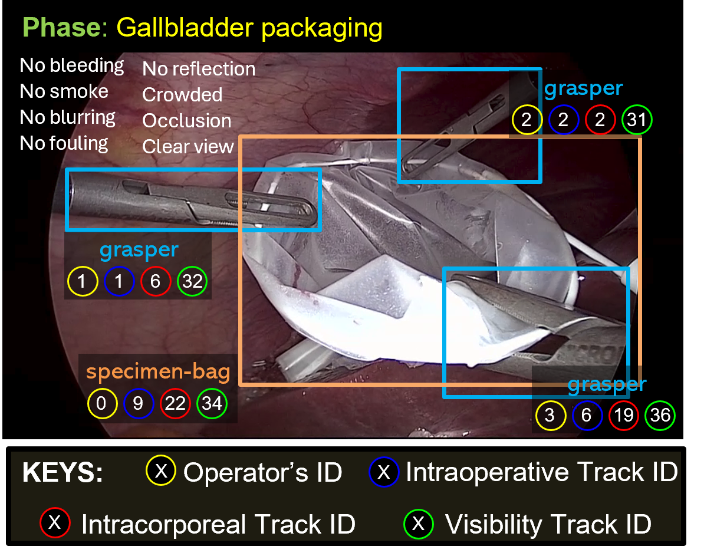

[Home](#home) | [Data Format](#format) | [Downloads](#download) | [Data Loader](#loader) | [Visualization Tools](#visualization) | [Evaluation Metrics](#metrics) | [Leaderboard](#leaderboard) | [Publication](#publication)

# CholecTrack20 Dataset

 
  

  <p align="justify">
CholecTrack20 is a surgical video dataset focusing on laparoscopic cholecystectomy and designed for surgical tool tracking, featuring 20 annotated videos. The dataset includes detailed labels for multi-class multi-tool tracking, offering trajectories for tool visibility within the camera scope, intracorporeal movement within the patient's body, and the life-long intraoperative trajectory of each tool. Annotations cover spatial coordinates, tool class, operator identity, phase, visual conditions (occlusion, bleeding, smoke), and more for tools like grasper, bipolar, hook, scissors, clipper, irrigator, and specimen bag, with annotations provided at 1 frame per second across 35K frames and 65K instance tool labels. The dataset uses official splits, allocating 10 videos for training, 2 for validation, and 8 for testing.
  </p> 


### ``Coming soon ...``

<!---->

----

## Citation
```
@misc{nwoye2023cholectrack20,
    title={CholecTrack20: A Dataset for Multi-Class Multiple Tool Tracking in Laparoscopic Surgery},
    author={Chinedu Innocent Nwoye and Kareem Elgohary and Anvita Srinivas and Fauzan Zaid and Joël L. Lavanchy and Nicolas Padoy},
    year={2023},
    eprint={2312.07352},
    archivePrefix={arXiv},
    primaryClass={cs.CV}
}
```

---

<!--A endoscopic video dataset for multi-class multi-tool tracking defined across 3 different perspectives of considering the temporal duration of a tool trajectory: (a) intraoperative, (b) intracorporeal, and (c) visibility.
-->
