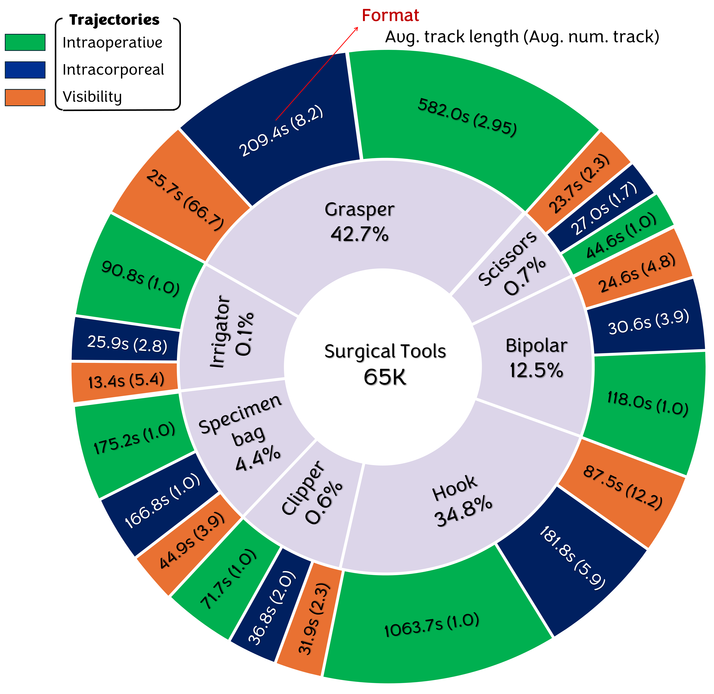

# CholecTrack20

**A Dataset for Multi-Class Multiple Tool Tracking in Laparoscopic Surgery**<br />
*Chinedu Innocent Nwoye,  Kareem Elgohary, Anvita Srinivas, Fauzan Zaid, Joël L. Lavanchy, and Nicolas Padoy* <br />


## ${\color{lightgreen}CVPR \space 2025}$


[](https://doi.org/10.1016/j.media.2022.102433)
   [](https://arxiv.org/abs/2312.07352) 
   [](https://vimeo.com/951853260)

   
 <hr />

 ### Abstract  

  <p align="justify">
CholecTrack20 is a surgical video dataset focusing on laparoscopic cholecystectomy and designed for surgical tool tracking, featuring 20 annotated videos. The dataset includes detailed labels for multi-class multi-tool tracking, offering trajectories for tool visibility within the camera scope, intracorporeal movement within the patient's body, and the life-long intraoperative trajectory of each tool. Annotations cover spatial coordinates, tool class, operator identity, phase, visual conditions (occlusion, bleeding, smoke), and more for tools like grasper, bipolar, hook, scissors, clipper, irrigator, and specimen bag, with annotations provided at 1 frame per second across 35K frames and 65K instance tool labels. The dataset uses official splits, allocating 10 videos for training, 2 for validation, and 8 for testing.
  </p> 

---
<br />

## Contents
The novel CholecTrack20 dataset consists of 20 videos of laparoscopic procedures that have been fully annotated with detailed labels for multi-class multi-tool tracking.


The dataset provides track identities across 3 perspectives of track definition: 
1. visibility trajectory of a tool within the camera scope,
2. intracorporeal trajectory of a tool while within a patient's body, and
3. life long intraoperative trajectory of a tool.

<br/>


   
<br/>

Intraoperative tracking not only re-identifies tools out of camera view (OOCV) as done in intracorporeal tracking but also maintains their trajectory when out of body (OOB).

<br/>


In the CholecTrack20 dataset, OOB is detected/annotated either by visually observing the tool exit the trocar, inferring from another tool entering through the same trocar, or noting that the initial tool releases its grasp while out of camera focus.

The dataset also provides detailed labels for each tool such as spatial bounding box coordinates, class identity, operator identity, phase identity, frame visual conditions such as occlusion, bleeding, and presence of smoke statuses, among others.

<br/>


<!--
<p align="center">
  
  
</p>
-->

<br/>


The annotated tool categories are grasper, bipolar, hook, scissors, clipper, irrigator and specimen bag. The annotated tool operators are main surgeon left hand (MSLH), main surgeon right hand (MSRH), assistant surgeon right hand (ASRH) and null operator (NULL). 

The annotations are provided at 1 frame per second (FPS) consisting of 35K frames and 65K instance tool labels. Raw videos, recorded at 25 FPS, are provided for inference. 


## Explore Samples


## Visualization and Validation


## Evaluation Metrics and Libraries

>> **DetEval** - Custom code for tool detection built on COCO API for Average Precision (AP) meterics.
 [code](https://github.com/CAMMA-public/cholectrack20/tree/main/DetEval)

>> **TrackEval** - Adapted trackEval to include CholecTrack20 benchmark. The metric library is built on widely used CLEAR MOT, Identity, VACE, Track mAP, J & F, ID Euclidean, and HOTA metrics. Either you pull from original trackEval repo or you clone our adaptation 
[code](https://github.com/CAMMA-public/cholectrack20/tree/main/TrackEval)


## Detection Benchmark and Leaderboard

- Benchmark of widely used and SOTA models on tool detection.
- Mean AP Results reported across detection thresholds, tool categories, and surgical visual challenges.

<table>
    <tr>
        <th rowspan=2 align="center">Detection model</th>
        <td colspan=3 align="center">Detection AP accross 3 thresholds</td>
        <td colspan=7 align="center">Detection AP per category. (\% AP @ $\Theta=0.5$)</td>
        <td colspan=8 align="center">Detection AP across surgical visual challenges</td>
        <td>Speed</td>
    </tr>
    <tr>
        <td>$AP_{0.5}\uparrow$</td>
        <td>$AP_{0.75}\uparrow$</td>
        <td>$AP_{0.5:0.95}\uparrow$</td>
        <td>Grasper</td>
        <td>Bipolar</td>
        <td>Hook</td>
        <td>Scissors</td>
        <td>Clipper</td>
        <td>Irrigator</td>
        <td>Bag</td>
        <td>Bleeding</td>
        <td>Blur</td>
        <td>Smoke</td>
        <td>Crowded</td>
        <td>Occluded</td>
        <td>Reflection</td>
        <td>Foul Lens</td>
        <td>Trocar</td>
        <td>$\text{FPS}\uparrow$ </td>
    </tr>
    <tr>
        <th>Faster-RCNN</th>
        <td>56.0</td>
        <td>38.1</td>
        <td>34.6</td>
        <td>53.5</td>
        <td>65.0</td>
        <td>80.1</td>
        <td>60.9</td>
        <td>70.1</td>
        <td>26.8</td>
        <td>31.8</td>
        <td>57.9</td>
        <td>41.0</td>
        <td>54.5</td>
        <td>43.5</td>
        <td>55.0</td>
        <td>46.9</td>
        <td>41.2</td>
        <td>35.7</td>
        <td>7.6</td>
    </tr>
    <tr>
        <th>Cascade-RCNN</th>
        <td>51.7</td>
        <td>39.0</td>
        <td>34.7</td>
        <td>52.0</td>
        <td>58.9</td>
        <td>79.7</td>
        <td>45.7</td>
        <td>44.9</td>
        <td>23.7</td>
        <td>17.9</td>
        <td>53.9</td>
        <td>39.0</td>
        <td>48.1</td>
        <td>39.5</td>
        <td>46.4</td>
        <td>29.1</td>
        <td>33.7</td>
        <td>33.7</td>
        <td>7.0</td>
    </tr>
    <tr>
        <th>CenterNet</th>
        <td>53.0</td>
        <td>39.5</td>
        <td>35.0</td>
        <td>60.2</td>
        <td>61.4</td>
        <td>86.4</td>
        <td>56.3</td>
        <td>68.0</td>
        <td>25.8</td>
        <td>10.2</td>
        <td>58.0</td>
        <td>42.1</td>
        <td>50.2</td>
        <td>36.7</td>
        <td>51.7</td>
        <td>46.0</td>
        <td>35.8</td>
        <td>30.8</td>
        <td><b>33.8</b></td>
    </tr>
    <tr>
        <th>FCOS</th>
        <td>43.5</td>
        <td>31.5</td>
        <td>28.1</td>
        <td>51.2</td>
        <td>44.3</td>
        <td>74.7</td>
        <td>49.2</td>
        <td>54.2</td>
        <td>21.9</td>
        <td>7.2</td>
        <td>47.8</td>
        <td>40.6</td>
        <td>51.5</td>
        <td>15.1</td>
        <td>40.8</td>
        <td>42.7</td>
        <td>29.7</td>
        <td>17.6</td>
        <td>7.7</td>
    </tr>
    <tr>
        <th>SSD</th>
        <td>61.9</td>
        <td>37.8</td>
        <td>36.1</td>
        <td>75.2</td>
        <td>62.2</td>
        <td>91.6</td>
        <td>63.4</td>
        <td>72.9</td>
        <td>22.5</td>
        <td>40.8</td>
        <td>64.5</td>
        <td>49.3</td>
        <td>58.3</td>
        <td>57.5</td>
        <td>62.4</td>
        <td>53.9</td>
        <td>47.7</td>
        <td>42.6</td>
        <td>30.9</td>
    </tr>
    <tr>
        <th>PAA</th>
        <td>64.5</td>
        <td>44.9</td>
        <td>41.1</td>
        <td>69.6</td>
        <td>79.0</td>
        <td>89.2</td>
        <td>68.7</td>
        <td>74.2</td>
        <td>37.6</td>
        <td>28.9</td>
        <td>67.1</td>
        <td>55.6</td>
        <td>65.0</td>
        <td>55.0</td>
        <td>64.6</td>
        <td>56.0</td>
        <td>51.2</td>
        <td>47.5</td>
        <td>8.5</td>
    </tr>
    <tr>
        <th>Def-DETR</th>
        <td>58.4</td>
        <td>42.0</td>
        <td>38.3</td>
        <td>60.6</td>
        <td>66.5</td>
        <td>83.8</td>
        <td>61.9</td>
        <td>72.0</td>
        <td>39.9</td>
        <td>23.8</td>
        <td>62.4</td>
        <td>42.7</td>
        <td>58.6</td>
        <td>37.1</td>
        <td>57.4</td>
        <td>43.9</td>
        <td>41.5</td>
        <td>47.4</td>
        <td>10.2</td>
    </tr>
    <tr>
        <th>Swin-T</th>
        <td>62.3</td>
        <td>44.3</td>
        <td>40.2</td>
        <td>63.3</td>
        <td>64.8</td>
        <td>83.0</td>
        <td>80.2</td>
        <td>77.2</td>
        <td>38.0</td>
        <td>26.8</td>
        <td>63.5</td>
        <td>53.8</td>
        <td>62.8</td>
        <td>35.3</td>
        <td>61.1</td>
        <td>66.2</td>
        <td>55.2</td>
        <td>45.7</td>
        <td>9.8</td>
    </tr>
    <tr>
        <th>YOLOX</th>
        <td>64.7</td>
        <td>48.9</td>
        <td>44.2</td>
        <td>69.6</td>
        <td>72.2</td>
        <td>89.4</td>
        <td>75.4</td>
        <td>79.1</td>
        <td>37.3</td>
        <td>27.1</td>
        <td>68.2</td>
        <td>55.6</td>
        <td>66.0</td>
        <td>45.9</td>
        <td>64.2</td>
        <td>52.5</td>
        <td>58.1</td>
        <td>43.1</td>
        <td>23.6</td>
    </tr>
    <tr>
        <th>YOLOv7</th>
        <td><b>80.6</b></td>
        <td>62.0</td>
        <td>56.1</td>
        <td><b> 90.5</b></td>
        <td>86.4</td>
        <td>96.0</td>
        <td><b> 82.3</b></td>
        <td><b> 89.3</b></td>
        <td>49.1</td>
        <td>66.2</td>
        <td><b> 80.2</b></td>
        <td>61.2</td>
        <td><b> 80.1</b></td>
        <td><b> 79.5</b></td>
        <td><b> 82.1</b></td>
        <td>65.6</td>
        <td><b> 71.2</b></td>
        <td><b> 66.7</b></td>
        <td>20.6</td>
    </tr>
    <tr>
        <th>YOLOv8</th>
        <td>79.1</td>
        <td>62.4</td>
        <td>55.6</td>
        <td>87.9</td>
        <td>84.5</td>
        <td><b> 96.2</b></td>
        <td>80.0</td>
        <td>87.2</td>
        <td>48.4</td>
        <td>65.0</td>
        <td>77.1</td>
        <td>58.3</td>
        <td>74.4</td>
        <td>76.2</td>
        <td>80.4</td>
        <td><b> 70.3</b></td>
        <td>57.4</td>
        <td>62.9</td>
        <td>29.0</td>
    </tr>
    <tr>
        <th>YOLOv9 </th>
        <td>80.2</td>
        <td><b> 62.6</b></td>
        <td><b> 56.5</b></td>
        <td>88.5</td>
        <td><b> 87.6</b></td>
        <td>96.0</td>
        <td>79.3</td>
        <td>87.1</td>
        <td>50.1</td>
        <td><b> 67.7</b></td>
        <td>78.1</td>
        <td>54.0</td>
        <td>78.2</td>
        <td>78.6</td>
        <td>81.1</td>
        <td>65.3</td>
        <td>63.4</td>
        <td>63.1</td>
        <td>23.7</td>
    </tr>
    <tr>
        <th>YOLOv10</th>
        <td>80.1</td>
        <td>62.1</td>
        <td>55.8</td>
        <td>87.6</td>
        <td>86.6</td>
        <td>96.0</td>
        <td>81.9</td>
        <td>89.0</td>
        <td><b> 53.8</b></td>
        <td>61.3</td>
        <td>77.8</td>
        <td><b> 61.9</b></td>
        <td>78.7</td>
        <td>77.5</td>
        <td>81.2</td>
        <td>66.7</td>
        <td>59.3</td>
        <td>65.4</td>
        <td>28.6</td>
    </tr>
</table>

<br/>

> Leaderboard available on [Papers with code](https://paperswithcode.com/dataset/cholectrack20)

<br/>


## Tracking Benchmark and Leaderboard


---

- Benchmark Multi-Perspective Multi-Tool Tracking Results @ 25 FPS
- Evaluated across multiple metrics: HOTA, CLEAR MOT, Identity, Count, and Efficiency Metrics
- Model assessed across 3 tracking perspectives
    
<table>
    <thead>
        <tr>
            <th rowspan="2">Model</th>
            <th colspan="4">HOTA Metrics</th>
            <th colspan="5">CLEAR Metrics</th>
            <th colspan="3">Identity Metrics</th>
            <th colspan="2">Count Metrics</th>
            <th>Speed</th>
        </tr>
        <tr>
            <th>HOTA↑</th>
            <th>DetA↑</th>
            <th>LocA↑</th>
            <th>AssA↑</th>
            <th>MOTA↑</th>
            <th>MOTP↑</th>
            <th>MT↑</th>
            <th>PT↓</th>
            <th>ML↓</th>
            <th>IDF1↑</th>
            <th>IDSW↓</th>
            <th>Frag↓</th>
            <th>#Dets</th>
            <th>#IDs</th>
            <th>FPS↑</th>
        </tr>
    </thead>
    <tbody>
        <!-- Intraoperative Trajectory Section -->
        <tr class="section-header">
            <td colspan="18" align="center"><b>Intraoperative Trajectory</b> (Groundtruth counts: #Dets = 29994, #IDs = 70)</td>
        </tr>
        <tr>
            <td>OCSORT</td>
            <td>14.6</td>
            <td>52.7</td>
            <td><b>86.7</b></td>
            <td>4.1</td>
            <td>49.2</td>
            <td><b>85.0</b></td>
            <td>24</td>
            <td>32</td>
            <td>14</td>
            <td>9.5</td>
            <td>2921</td>
            <td>2731</td>
            <td>21936</td>
            <td>3336</td>
            <td>10.2</td>
        </tr>
        <tr>
            <td>FairMOT</td>
            <td>5.8</td>
            <td>25.8</td>
            <td>75.9</td>
            <td>1.3</td>
            <td>5.0</td>
            <td>73.9</td>
            <td>3</td>
            <td>24</td>
            <td>43</td>
            <td>4.3</td>
            <td>4227</td>
            <td>1924</td>
            <td>15252</td>
            <td>4456</td>
            <td>14.2</td>
        </tr>
        <tr>
            <td>TransTrack</td>
            <td>7.4</td>
            <td>31.5</td>
            <td>84.4</td>
            <td>1.7</td>
            <td>4.2</td>
            <td>82.9</td>
            <td>9</td>
            <td>36</td>
            <td>25</td>
            <td>4.2</td>
            <td>4757</td>
            <td><b>1899</b></td>
            <td>21640</td>
            <td>4079</td>
            <td>6.7</td>
        </tr>
        <tr>
            <td>ByteTrack</td>
            <td>15.8</td>
            <td>70.6</td>
            <td>85.7</td>
            <td>3.6</td>
            <td>67.0</td>
            <td>84.0</td>
            <td>54</td>
            <td>12</td>
            <td>2</td>
            <td>9.5</td>
            <td>4648</td>
            <td>2429</td>
            <td>28440</td>
            <td>5383</td>
            <td>16.4</td>
        </tr>
        <tr>
            <td>Bot-SORT</td>
            <td>17.4</td>
            <td>70.7</td>
            <td>85.4</td>
            <td>4.4</td>
            <td>69.6</td>
            <td>83.7</td>
            <td><b>58</b></td>
            <td>11</td>
            <td><b>1</b></td>
            <td>10.2</td>
            <td>3907</td>
            <td>2376</td>
            <td>29302</td>
            <td>4501</td>
            <td>8.7</td>
        </tr>
        <tr>
            <td>SMILETrack</td>
            <td>15.9</td>
            <td>71.0</td>
            <td>85.5</td>
            <td>3.7</td>
            <td>66.4</td>
            <td>83.8</td>
            <td>55</td>
            <td>13</td>
            <td>2</td>
            <td>9.2</td>
            <td>4968</td>
            <td>2369</td>
            <td>28821</td>
            <td>5761</td>
            <td>11.2</td>
        </tr>
        <!-- Intracorporeal Trajectory Section -->
        <tr class="section-header">
            <td colspan="18" align="center"><b>Intracorporeal Trajectory</b> (Groundtruth counts: #Dets = 29994, #IDs = 247)</td>
        </tr>
        <tr>
            <td>OCSORT</td>
            <td>23.7</td>
            <td>51.4</td>
            <td>86.5</td>
            <td>11.0</td>
            <td>47.1</td>
            <td>84.8</td>
            <td>115</td>
            <td>87</td>
            <td>45</td>
            <td>18.1</td>
            <td>2953</td>
            <td>2796</td>
            <td>21797</td>
            <td>3526</td>
            <td>10.2</td>
        </tr>
        <tr>
            <td>FairMOT</td>
            <td>7.5</td>
            <td>19.7</td>
            <td>76.1</td>
            <td>2.9</td>
            <td>5.4</td>
            <td>74.0</td>
            <td>19</td>
            <td>60</td>
            <td>168</td>
            <td>6.0</td>
            <td>2890</td>
            <td>1496</td>
            <td>11287</td>
            <td>3962</td>
            <td>14.2</td>
        </tr>
        <tr>
            <td>TransTrack</td>
            <td>13.1</td>
            <td>31.5</td>
            <td>84.4</td>
            <td>5.5</td>
            <td>4.6</td>
            <td>82.9</td>
            <td>80</td>
            <td>79</td>
            <td>88</td>
            <td>8.7</td>
            <td>4648</td>
            <td><b>1791</b></td>
            <td>21640</td>
            <td>4079</td>
            <td>6.7</td>
        </tr>
        <tr>
            <td>ByteTrack</td>
            <td>24.7</td>
            <td>70.6</td>
            <td>85.7</td>
            <td>8.7</td>
            <td>67.4</td>
            <td>84.0</td>
            <td>176</td>
            <td>48</td>
            <td>23</td>
            <td>16.9</td>
            <td>4515</td>
            <td>2290</td>
            <td>28440</td>
            <td>5383</td>
            <td>16.4</td>
        </tr>
        <tr>
            <td>Bot-SORT</td>
            <td>27.0</td>
            <td>70.7</td>
            <td>85.4</td>
            <td>10.4</td>
            <td>70.0</td>
            <td>83.7</td>
            <td><b>188</b></td>
            <td>38</td>
            <td><b>21</b></td>
            <td>18.9</td>
            <td>3771</td>
            <td>2238</td>
            <td><b>29300</b></td>
            <td>4501</td>
            <td>8.7</td>
        </tr>
        <tr>
            <td>SMILETrack</td>
            <td>24.9</td>
            <td>66.7</td>
            <td>85.5</td>
            <td>8.9</td>
            <td>66.7</td>
            <td>83.8</td>
            <td>186</td>
            <td>39</td>
            <td>22</td>
            <td>16.9</td>
            <td>4868</td>
            <td>2232</td>
            <td>28820</td>
            <td>5779</td>
            <td>11.2</td>
        </tr>
        <!-- Visibility Trajectory Section -->
        <tr class="section-header">
            <td colspan="18" align="center"><b>Visibility Trajectory</b> (Groundtruth counts: #Dets = 29994, #IDs = 916)</td>
        </tr>
        <tr>
            <td>SORT</td>
            <td>17.4</td>
            <td>39.5</td>
            <td>85.2</td>
            <td>7.8</td>
            <td>21.4</td>
            <td>83.3</td>
            <td>139</td>
            <td>399</td>
            <td>378</td>
            <td>13.4</td>
            <td>6619</td>
            <td>2138</td>
            <td>16595</td>
            <td>8844</td>
            <td>19.5</td>
        </tr>
        <tr>
            <td>OCSORT</td>
            <td>37.0</td>
            <td>52.6</td>
            <td>86.5</td>
            <td>26.2</td>
            <td>50.2</td>
            <td>84.8</td>
            <td>300</td>
            <td>371</td>
            <td>245</td>
            <td>35.9</td>
            <td>2317</td>
            <td>2260</td>
            <td>22197</td>
            <td>3587</td>
            <td>10.2</td>
        </tr>
        <tr>
            <td>FairMOT</td>
            <td>15.3</td>
            <td>25.0</td>
            <td>75.8</td>
            <td>9.5</td>
            <td>7.1</td>
            <td>73.7</td>
            <td>58</td>
            <td>218</td>
            <td>640</td>
            <td>14.4</td>
            <td>3140</td>
            <td>1574</td>
            <td>15338</td>
            <td>4875</td>
            <td>14.2</td>
        </tr>
        <tr>
            <td>TransTrack</td>
            <td>19.2</td>
            <td>31.6</td>
            <td>84.4</td>
            <td>11.8</td>
            <td>5.8</td>
            <td>82.9</td>
            <td>224</td>
            <td>280</td>
            <td>412</td>
            <td>16.1</td>
            <td>4273</td>
            <td><b>1403</b></td>
            <td>21640</td>
            <td>4079</td>
            <td>6.7</td>
        </tr>
        <tr>
            <td>ByteTrack</td>
            <td>41.5</td>
            <td>70.7</td>
            <td>85.7</td>
            <td>24.8</td>
            <td>69.3</td>
            <td>84.0</td>
            <td>591</td>
            <td>217</td>
            <td>108</td>
            <td>36.8</td>
            <td>3930</td>
            <td>1704</td>
            <td>28440</td>
            <td>5383</td>
            <td>16.4</td>
        </tr>
        <tr>
            <td>Bot-SORT</td>
            <td>44.7</td>
            <td>70.8</td>
            <td>85.5</td>
            <td>28.7</td>
            <td>72.0</td>
            <td>83.7</td>
            <td><b>638</b></td>
            <td>184</td>
            <td><b>94</b></td>
            <td>41.4</td>
            <td>3183</td>
            <td>1638</td>
            <td><b>29300</b></td>
            <td>4505</td>
            <td>8.7</td>
        </tr>
        <tr>
            <td>SMILETrack</td>
            <td>41.3</td>
            <td>71.0</td>
            <td>85.6</td>
            <td>24.4</td>
            <td>68.9</td>
            <td>83.8</td>
            <td>619</td>
            <td>192</td>
            <td>105</td>
            <td>36.5</td>
            <td>4227</td>
            <td>1641</td>
            <td>28821</td>
            <td>5752</td>
            <td>11.2</td>
        </tr>
    </tbody>
</table>


<br/>

> Leaderboard available on [Papers with code](https://paperswithcode.com/dataset/cholectrack20)

<br/>


### Tracking Across Scene Visual Challenges


<br/>


## Emerging Research Methods
- SurgiTrack - a new SOTA method on the dataset is published as [here](https://github.com/CAMMA-public/surgitrack)


<br/>


# Download

Steps to obtain the dataset:

1. Read the [Data Use Agreement (DUA)](DUA.md)

2. Dataset is released under the license [CC-BY-NC-SA 4.0](LICENSE.txt)

3. Complete the dataset request [Form](https://docs.google.com/forms/d/e/1FAIpQLSdewhAi0vGmZj5DLOMWdLf85BhUtTedS28YzvHS58ViwuEX5w/viewform?usp=sharing) to receive the download `accesskey`, it will be needed in the next step, keep it safe!

4. Visit the data portal at [Synapse.org](https://www.synapse.org/Synapse:syn53182642/wiki/) to download the dataset.

<br/>


## Acknowledgement

This work was supported by French state funds managed within the Plan Investissements d’Avenir by the ANR under references: National AI Chair AI4ORSafety [ANR-20-CHIA-0029-01], DeepSurg [ANR-16-CE33-0009], IHU Strasbourg [ANR-10-IAHU-02] and by BPI France under references: project CONDOR, project 5G-OR. 
Joël L. Lavanchy received funding by the Swiss National Science Foundation (P500PM\_206724, P5R5PM\_217663). 
This work was granted access to the servers/HPC resources managed by CAMMA, IHU Strasbourg, Unistra Mesocentre, and GENCI-IDRIS [Grant 2021-AD011011638R3, 2021-AD011011638R4].

<br />

Metric evaluation part of the codes are borrowed from [TrackEval](https://github.com/JonathonLuiten/TrackEval) and [Cocoapi](https://github.com/cocodataset/cocoapi/blob/master/PythonAPI/pycocotools/cocoeval.py). Thanks for their excellent work!


## Publication & Citations

- Conference
  
```
@InProceedings{nwoye2023cholectrack20,
  author    = {Nwoye, Chinedu Innocent and Elgohary , Kareem  and Srinivas, Anvita and Zaid, Fauzan and Lavanchy, Joël L.  and Padoy, Nicolas},
  title     = {CholecTrack20: A Multi-Perspective Tracking Dataset for Surgical Tools},
  booktitle = {Proceedings of the IEEE/CVF Conference on Computer Vision and Pattern Recognition (CVPR)},
  year      = {2025},
  month     = {June}
}
```

- arXiv
  
```

@misc{nwoye2023cholectrack20,
    title={CholecTrack20: A Dataset for Multi-Class Multiple Tool Tracking in Laparoscopic Surgery},
    author={Chinedu Innocent Nwoye and Kareem Elgohary and Anvita Srinivas and Fauzan Zaid and Joël L. Lavanchy and Nicolas Padoy},
    year={2023},
    eprint={2312.07352},
    archivePrefix={arXiv},
    primaryClass={cs.CV}
}
```

---

**CholecTrack** - An endoscopic video dataset for multi-class multi-tool tracking defined across 3 different perspectives of considering the temporal duration of a tool trajectory: (a) intraoperative, (b) intracorporeal, and (c) visibility.

---


## Contributing
We welcome contributions of new metrics and new supported benchmarks. Also any other new features or code improvements. Send a PR, an email, or open an issue detailing what you'd like to add/change to begin a conversation.
